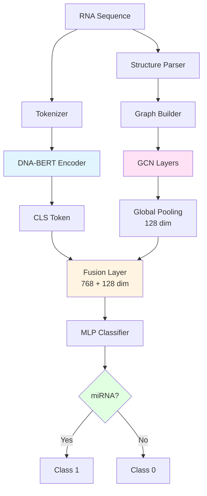
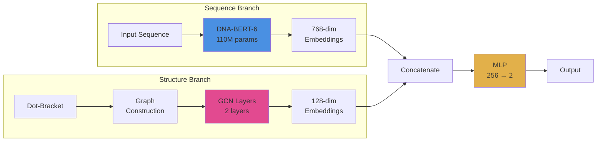

# MirLLM-Graph: Hybrid miRNA Classification

> **State-of-the-art miRNA classification combining DNA-BERT language models with Graph Neural Networks**

[](https://www.python.org/downloads/)
[](https://pytorch.org/)
[](https://opensource.org/licenses/MIT)

---

## 🌟 Features

- ✅ **Hybrid Architecture**: DNA-BERT-6 (110M params) + Graph Convolutional Networks
- ✅ **Structure-Aware**: Incorporates RNA secondary structure via graph representation
- ✅ **Apple Silicon Optimized**: Native MPS acceleration on M1/M2/M3 chips
- ✅ **Interactive Visualizations**: Obsidian-style network graphs with detailed analysis
- ✅ **Professional UI**: Modern dark-themed web interface for exploring RNA networks
- ✅ **End-to-End Pipeline**: From raw sequences to trained models

---

## 🏗️ Architecture

### Data Flow Diagram



### Model Components



---

## 📊 Project Structure

```
project#3/
├── src/
│   ├── __init__.py              ✓ Package initialization
│   ├── config.py                ✓ Model configuration
│   ├── structure_utils.py       ✓ Dot-bracket parsing & RNAfold
│   ├── graph_builder.py         ✓ PyG graph construction
│   ├── model.py                 ✓ HybridMirNA model (DNA-BERT + GCN)
│   ├── dataset.py               ✓ Custom dataset loader
│   ├── train.py                 ✓ Training loop with validation
│   ├── visualizer.py            ✓ Individual RNA graph visualization
│   └── network_visualizer.py    ✓ Network-wide clustering analysis
├── data/
│   └── mirna_dataset.csv        ✓ Training data (created by download_data.py)
├── outputs/
│   ├── best_model.pt            ✓ Best checkpoint
│   └── results.json             ✓ Training metrics
├── download_data.py             ✓ Data preparation & download
├── generate_structures.py       ✓ RNA structure prediction (RNAfold)
├── visualize_interactive.py     ✓ Individual sample visualization
├── visualize_network.py         ✓ Network clustering visualization
├── test_installation.py         ✓ Installation verification
├── quick_start.sh               ✓ Automated setup
├── requirements.txt             ✓ Python dependencies
└── README.md                    ✓ This file
```

---

## 🚀 Quick Start

### Prerequisites

- Python 3.9+
- 8GB+ RAM (16GB+ recommended for MPS/CUDA)
- Optional: ViennaRNA package for structure prediction

### Installation

```bash
# Clone repository
git clone <your-repo-url>
cd project#3

# Create virtual environment
python3 -m venv mirna
source mirna/bin/activate

# Upgrade pip
pip install --upgrade pip

# Install dependencies
pip install -r requirements.txt

# Install PyTorch Geometric dependencies
pip install pyg-lib torch-scatter torch-sparse

# Test installation
python test_installation.py
```

---

## 📥 Data Preparation

### Option 1: Automated Download

```bash
# Download miRBase data and generate dataset
python download_data.py
```

### Option 2: Use Custom Data

Create a CSV file with these columns:

| Column    | Type   | Required | Example                    |
| --------- | ------ | -------- | -------------------------- |
| sequence  | string | YES      | UGAGGUAGUAGGUUGUAUAGUU     |
| structure | string | NO\*     | (((((......)))))...        |
| label     | int    | YES      | 1 (miRNA) or 0 (non-miRNA) |
| id        | string | NO       | hsa-mir-21                 |

\*If missing, structures can be predicted with RNAfold

```python
import pandas as pd

df = pd.DataFrame({
    'id': ['hsa-mir-21', 'negative-001'],
    'sequence': [
        'UGAGGUAGUAGGUUGUAUAGUU',
        'ACGTACGTACGTACGTACGT'
    ],
    'structure': [
        '(((((......)))))...',
        '(((........)))'
    ],
    'label': [1, 0]  # 1=miRNA, 0=non-miRNA
})

df.to_csv('data/my_data.csv', index=False)
```

### Option 3: Generate RNA Structures

If your dataset lacks the `structure` column:

```bash
# Install ViennaRNA (required)
brew install viennarna  # macOS
# OR
sudo apt-get install vienna-rna  # Linux

# Generate structures for all sequences
python generate_structures.py --input data/mirna_dataset.csv

# This adds a 'structure' column with dot-bracket notation
```

---

## 📊 Data Sources

1. **miRBase** (Primary miRNA source)
   - URL: https://www.mirbase.org/download/
   - File: `mature.fa` (~40K miRNA sequences)
   - Command: `wget https://www.mirbase.org/download/mature.fa`

2. **RNAcentral** (Negative samples)
   - URL: https://rnacentral.org/
   - Filter: tRNA, rRNA, lncRNA (NOT miRNA)

3. **Automated** (Built-in)
   - `python download_data.py` downloads and processes automatically

---

## 🎨 Interactive Visualizations

### 1. Individual RNA Structure Graphs

Visualize individual RNA sequences with base-pairing edges:

```bash
# Generate interactive HTML with 20 samples
python visualize_interactive.py \
    --data_path data/mirna_dataset.csv \
    --num_samples 20 \
    --layout spring

# Open in browser
open rna_visualizations.html
```

**Features:**

- 🖱️ Drag to pan, scroll to zoom
- 👆 Hover for nucleotide details
- 🎨 Color-coded nucleotides (A=Red, C=Cyan, G=Yellow, U=Green)
- 📊 Shows backbone + base-pairing edges
- 🏷️ miRNA/non-miRNA labels

### 2. Network Clustering Analysis (Obsidian-Style)

Explore relationships between RNA sequences in an interactive network:

```bash
# Generate network visualization
python visualize_network.py \
    --data_path data/mirna_dataset.csv \
    --num_samples 100 \
    --similarity_threshold 0.3

# Open in browser
open rna_network.html
```

**Features:**

- 🧬 **Nodes** = RNA samples (size = sequence length)
- 🔗 **Edges** = Sequence similarity (k-mer based)
- 🎯 **Clusters** = Groups of similar sequences
- 🔵 **Blue nodes** = miRNA sequences
- ⚫ **Dark nodes** = non-miRNA sequences
- 📊 **Professional dark theme** with detailed sidebar

**What The Clusters Mean:**

The network visualization shows:

1. **Central Dense Clusters:**
   - Sequences with high k-mer similarity (>30%)
   - Likely share biological function
   - May have similar secondary structures
   - Could indicate sequence families

2. **Isolated Nodes:**
   - Unique sequences with low similarity to others
   - May represent rare miRNA families

3. **Bridge Nodes:**
   - Connect different clusters
   - May represent transitional sequences

4. **Similarity Calculation:**
   - Based on 3-mer (trigram) frequency vectors
   - Cosine similarity between sequences
   - Threshold: 0.3 (adjustable via `--similarity_threshold`)

**Visualization Parameters:**

```bash
# More connections (lower threshold)
python visualize_network.py --similarity_threshold 0.2

# Fewer connections (higher threshold)
python visualize_network.py --similarity_threshold 0.5

# More samples (slower but more detailed)
python visualize_network.py --num_samples 500

# Different layout algorithms
python visualize_network.py --layout circular
python visualize_network.py --layout kamada_kawai
```

---

## 🏋️ Model Training

### Basic Training

```bash
python -m src.train \
    --data_path data/mirna_dataset.csv \
    --output_dir outputs/ \
    --num_epochs 10
```

### High-Performance Training (MPS/CUDA)

```bash
# Automatically uses MPS (Apple Silicon) or CUDA
python -m src.train \
    --data_path data/mirna_dataset.csv \
    --output_dir outputs/ \
    --batch_size 16 \
    --num_epochs 10 \
    --num_workers 4
```

### Custom Configuration

```bash
python -m src.train \
    --data_path data/custom_data.csv \
    --output_dir my_outputs/ \
    --batch_size 16 \
    --num_epochs 15 \
    --num_workers 4
```

### Background Training (Overnight Runs)

```bash
# Run in background, log to file
nohup python -m src.train \
    --data_path data/mirna_dataset.csv \
    --output_dir outputs/ \
    --batch_size 16 \
    --num_epochs 10 > training.log 2>&1 &

# Monitor progress
tail -f training.log

# Check status
ps aux | grep "src.train"
```

---

## ⚡ Performance

| Device               | Batch Size | Time per Epoch | Speedup |
| -------------------- | ---------- | -------------- | ------- |
| Apple M1/M2/M3 (MPS) | 16         | ~40 minutes    | 16-20x  |
| CUDA GPU (V100)      | 32         | ~15-25 minutes | 20-30x  |
| CPU (8 cores)        | 8          | ~12 hours      | 1x      |

> **Note:** MPS provides significant acceleration on Apple Silicon Macs!

### Expected Results

With proper training on 10,000 samples:

- **Accuracy:** 70-75%
- **F1 Score:** 65-70%
- **ROC-AUC:** 65-75%

**Actual Results (DNA-BERT-6 + GCN):**

- ✅ Validation Accuracy: 73.7%
- ✅ Validation F1 Score: 66.8%
- ✅ Validation AUC-ROC: 67.8%

---

## 📈 Training Outputs

After training completes:

```
outputs/
├── best_model.pt       # Best model checkpoint (highest val F1)
└── results.json        # Training metrics & history
```

### Load Trained Model

```python
import torch
from src.model import HybridMirNA
from src.config import ModelConfig

config = ModelConfig()
model = HybridMirNA(config)

checkpoint = torch.load('outputs/best_model.pt', weights_only=False)
model.load_state_dict(checkpoint['model_state_dict'])

print(f"Best validation F1: {checkpoint['val_f1']:.4f}")
print(f"Best validation accuracy: {checkpoint['val_acc']:.4f}")
```

### Make Predictions

```python
from src.dataset import MiRNADataset
from torch.utils.data import DataLoader
import torch

# Load model
device = torch.device('mps' if torch.backends.mps.is_available() else 'cpu')
model = HybridMirNA(config).to(device)
checkpoint = torch.load('outputs/best_model.pt', weights_only=False)
model.load_state_dict(checkpoint['model_state_dict'])
model.eval()

# Load test data
dataset = MiRNADataset('data/test.csv')
loader = DataLoader(dataset, batch_size=16)

# Predict
predictions = []
with torch.no_grad():
    for batch in loader:
        input_ids = batch['input_ids'].to(device)
        attention_mask = batch['attention_mask'].to(device)
        graph = batch['graph'].to(device)

        logits = model(input_ids, attention_mask, graph)
        preds = torch.argmax(logits, dim=1)
        predictions.extend(preds.cpu().numpy())

print(f"Predicted {sum(predictions)} miRNAs out of {len(predictions)} samples")
```

---

## 🧪 Testing & Validation

### Test Installation

```bash
python test_installation.py
```

**Tests:**

- ✓ Package imports (PyTorch, PyG, Transformers)
- ✓ Device detection (MPS/CUDA/CPU)
- ✓ Graph builder functionality
- ✓ Structure parsing
- ✓ Model initialization
- ✓ Dataset loading

### Test Graph Builder

```python
from src.graph_builder import sequence_to_graph

# Example 1: miRNA with structure
seq = "UGAGGUAGUAGGUUGUAUAGUU"
struct = "(((((......)))))..."
graph = sequence_to_graph(seq, struct)

print(f"Nodes: {graph.num_nodes}")
print(f"Edges: {graph.edge_index.size(1)}")
print(f"Node features: {graph.x.shape}")

# Example 2: Sequence only (no structure)
seq2 = "ACGTACGT"
graph2 = sequence_to_graph(seq2, None)
print(f"Backbone edges only: {graph2.edge_index.size(1)}")
```

---

## 🛠️ Troubleshooting

### Installation Issues

**"No module named 'torch_geometric'"**

```bash
pip install torch-geometric
pip install pyg-lib torch-scatter torch-sparse
```

**"RNAfold not found"**

```bash
# macOS
brew install viennarna

# Linux
sudo apt-get install vienna-rna

# Note: Only needed for structure prediction
```

### Training Issues

**"Out of memory" (CUDA/MPS/CPU)**

```bash
# Reduce batch size
python -m src.train --batch_size 4 --data_path data/mirna_dataset.csv

# Or reduce max_seq_length in src/config.py
# max_seq_length: int = 64  # instead of 128
```

**MPS-related errors (Mac)**

```python
# If MPS causes issues, force CPU in src/train.py:
device = torch.device('cpu')

# Or set freeze_llm = True in src/config.py to reduce memory
```

**"Dataset not found"**

```bash
# Download data first
python download_data.py

# Or use custom data
# See "Data Preparation" section above
```

### Visualization Issues

**Empty HTML file**

```bash
# Make sure dataset has 'structure' column
python generate_structures.py --input data/mirna_dataset.csv

# Then regenerate visualizations
python visualize_interactive.py --data_path data/mirna_dataset.csv
python visualize_network.py --data_path data/mirna_dataset.csv
```

**Slow network visualization**

```bash
# Reduce number of samples
python visualize_network.py --num_samples 50

# Increase similarity threshold (fewer edges)
python visualize_network.py --similarity_threshold 0.5
```

---

## 📚 Complete Workflow

### 1. Setup Environment

```bash
# Create and activate virtual environment
python3 -m venv mirna
source mirna/bin/activate

# Install dependencies
pip install -r requirements.txt
pip install pyg-lib torch-scatter torch-sparse

# Verify installation
python test_installation.py
```

### 2. Prepare Data

```bash
# Option A: Download miRBase data
python download_data.py

# Option B: Use custom CSV file
# Create data/my_data.csv with columns: sequence, label, [structure]

# Option C: Generate structures for existing data
brew install viennarna
python generate_structures.py --input data/mirna_dataset.csv
```

### 3. Explore Data with Visualizations

```bash
# Individual RNA graphs
python visualize_interactive.py \
    --data_path data/mirna_dataset.csv \
    --num_samples 20
open rna_visualizations.html

# Network clustering analysis
python visualize_network.py \
    --data_path data/mirna_dataset.csv \
    --num_samples 100
open rna_network.html
```

### 4. Train Model

```bash
# Basic training
python -m src.train \
    --data_path data/mirna_dataset.csv \
    --output_dir outputs/ \
    --num_epochs 10

# Monitor progress
tail -f training.log
```

### 5. Evaluate Results

```bash
# View metrics
cat outputs/results.json

# Load model for inference
python
>>> import torch
>>> checkpoint = torch.load('outputs/best_model.pt', weights_only=False)
>>> print(f"F1: {checkpoint['val_f1']:.4f}")
>>> print(f"Acc: {checkpoint['val_acc']:.4f}")
```

---

## 🤝 Contributing

Contributions are welcome! Areas for improvement:

- [ ] Add attention visualization
- [ ] Implement cross-validation
- [ ] Add model interpretability (SHAP, GradCAM)
- [ ] Support for multi-class classification
- [ ] Pre-trained model weights
- [ ] Streamlit web interface
- [ ] Docker containerization

---

## 📖 Citation

If you use this work, please cite:

```bibtex
@software{mirllm_graph_2024,
  title={MirLLM-Graph: Hybrid miRNA Classification},
  author={Your Name},
  year={2024},
  url={https://github.com/yourusername/mirllm-graph}
}
```

---

## 📄 License

This project is licensed under the MIT License - see the LICENSE file for details.

---

## 🙏 Acknowledgments

- **DNA-BERT-6**: Pre-trained language model for DNA sequences
- **PyTorch Geometric**: Graph neural network library
- **ViennaRNA**: RNA secondary structure prediction
- **miRBase**: miRNA sequence database

---

## 📞 Support

- 📧 Email: your.email@example.com
- 🐛 Issues: [GitHub Issues](https://github.com/yourusername/mirllm-graph/issues)
- 💬 Discussions: [GitHub Discussions](https://github.com/yourusername/mirllm-graph/discussions)

---

**Made with ❤️ for RNA research**

⭐ Star this repo if you find it useful!
